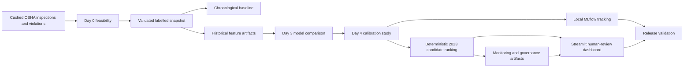
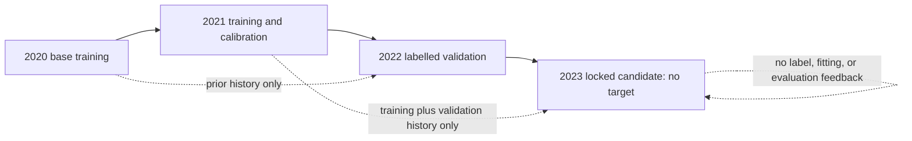
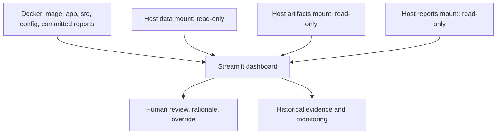

# InspectIQ architecture

## End-to-end flow

The source snapshot ID identifies the immutable validated foundation; the feature version identifies the feature schema and historical-information contract. Current lineage uses snapshot `edbd4bd813ed8e1dbaba9e1c` and `day2-historical-v1`.

## Chronology and information boundaries

Training contains 2020–2021 labels; validation is 2022. The candidate batch is 2023 and has no target column. Strictly-prior feature construction prevents a row, future row, or same-day peer from leaking target information into its features.

## Selection and lineage

The baseline uses training-period industry rates with deterministic fallback. Eight Day 3 candidates are evaluated on 2022 validation; `exp_05_random_forest` is selected. Day 4 compares uncalibrated, sigmoid, and isotonic study artifacts. The final selected package remains uncalibrated because no calibrator qualified under the probability-quality and ranking policy.

MLflow uses a local SQLite store and deterministic logical keys: 8 Day 3 runs plus 3 Day 4 runs are reusable. Batch scoring reads the selected final candidate, generates immutable ranked and top-budget CSVs, and records hashes. It neither refits nor accesses candidate outcomes.

## Dashboard runtime contract

The dashboard consumes existing artifacts and reports. It never retrieves data, starts a training job, recalibrates, or regenerates candidates at startup. Missing required mounted artifacts produce an actionable validation error.

## Monitoring and release architecture

Monitoring compares 2023 candidate features with 2022 validation (primary reference) and 2020–2021 training (secondary reference). Data drift and score-distribution drift are descriptive; neither proves current performance drift without outcomes. Governance outputs include review and future-outcome templates, with hashes for auditability.

`run_release_validation.py --mode ci` checks source, configuration, committed reports, imports, workflow, Docker contract, documentation, and safety without local artifacts. `--mode local` additionally verifies frozen artifact paths, hashes, counts, and governance templates. The Docker image intentionally excludes raw/processed data, MLflow state, models, predictions, and monitoring artifacts; Compose mounts them read-only for local runtime.

## Safety boundaries

InspectIQ is candidate ranking for human review. It does not assert a violation, provide a calibrated probability, join 2023 labels, calculate current performance or outcome fairness, deploy an enforcement service, or automatically trigger enforcement.
